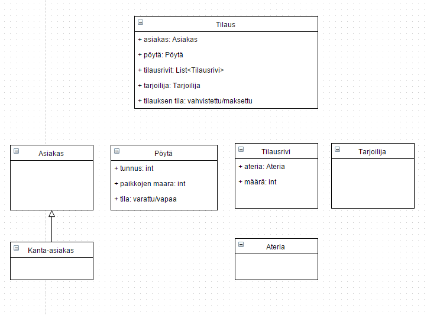
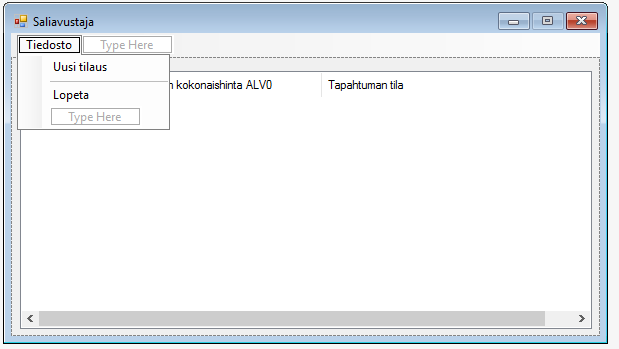
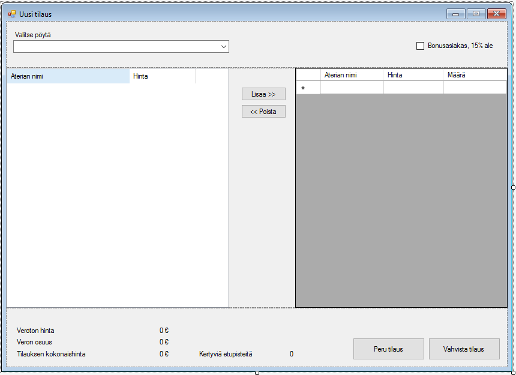

# Agile, Käyttäjätarina ja käyttötapaus

## Asiakkaan kertomus ongelmakohdasta

Ravintolassani `asiakkaani` ohjataan ensin `pöytään`. Työskentelyvuorossa oleva `tarjoilija`, joka on ohjannut asiakkaat pöytään, ottaa vastaan heidän `tilauksensa`.

Tarjoilija kysyy, mitä juomia ja `ateria` -vaihtoehtoja he haluavat. Ruuat ja juomat tarjoillaan yleensä eri aikaan toimitettuina. Asiakkaalta voidaan kysyä myös, onko asiakkaalla näyttää `kanta-asiakas` -korttia tai etukuponkeja. Kanta-asiakkaana tai `etukupongilla` asiakas saa yleensä 15% alennuksen tilauksen loppusummasta.

Kun tarjoilija on merkinnyt tilauksen päätelaitteellaan järjestelmään, hän vahvistaa `tilauksen` ja tieto `tilauksen` sisällöstä tallentuu. `Tilauksen` sisältö on nähtävissä esimerkiksi `keittiön` puolella tai muissa järjestelmissä. Tilausta ei ole vielä tässä vaiheessa maksettu, joten on tärkeää pystyä erottamaan, onko tilaus vain `vahvistettu tai maksettu`.

 Kun `asiakas` on syönyt, `tarjoilija` palaa kysymään asiakkaan kuulumisia. Tässä yhteydessä, jos `asiakas` on valmis, hän yleensä maksaa tilauksensa.

## Käyttäjätarina

Tarjoilijana  
tahdon merkitä vastaanotettavan tilauksen järjestelmään,  
jotta tilauksen sisältö on selkeä keittiön henkilökunnalle.

## Käyttötapaus

**Otsikko**

Uuden tilauksen vastaanottaminen

**Tavoite**

Tarjoilija saa merkittyä asiakkaan tilauksen tilausrivit järjestelmään.

**Esiehdot**

Tilauksessa on oltava valittuna pöytä, joka ei ole varattu sillä hetkellä.  
Tilauksessa on oltava vähintään yksi tilausrivi.  
Tilauksessa on oltava merkittynä asiakkaasta tieto, onko hän kanta-asiakas tai käyttänyt etukuponkia.

**Onnistunut lopputulos**

Tilauksen tiedot ovat tallennettu järjestelmään. \(esim tietokanta, tekstitiedosto tai jokin muu\)

**Virheellinen lopputulos**

Tilaus epäonnistuu eikä sen tiedot tallennu oikeassa muodossa järjestelmään.

**Kuvaus käyttötapauksesta**

1. Tarjoilija painaa painiketta, joka luo uuden tyhjän tilauksen.
2. Tarjoilija merkitsee tilaukselle pöydän.
3. Tarjoilija lisää tilaukseen aterioita ja niiden määrän.
   1. Aterioita lisättäessä, tarjoilija näkee aina päivitetyn loppusumman.
4. Tarjoilija merkitsee tiedon, jos kyseessä on kanta-asiakas tai etukuponki.
5. Tarjoilija vahvistaa tilauksen
6. Onnistuneen vahvistamisen jälkeen, ohjelma palaa tarvittaessa alkutilaan.

**Kuvaus virheellisestä käyttötapauksesta**

5 kohdassa kun tarjoilija on vahvistanut tilauksen, ohjelman pitää pystyä toipumaan virhetilanteista, jotka on mainittu esiehdoissa. Näistä tietojen puutteista on näytettävä virhe tarjoilijalle ja hänen on pystyttävä täydentämään puuttuvat tiedot ilman, että joutuu aloittamaan alusta.

## Luokkakaavio

Asiakkaan kuvauksessa ja käyttötapauksessa esiintyy seuraavia termejä:

Asiakas  
Kanta-asiakas  
Tarjoilija  
Tilaus  
Tilausrivi  
Ateria  
Pöytä

## Käyttöliittymä

